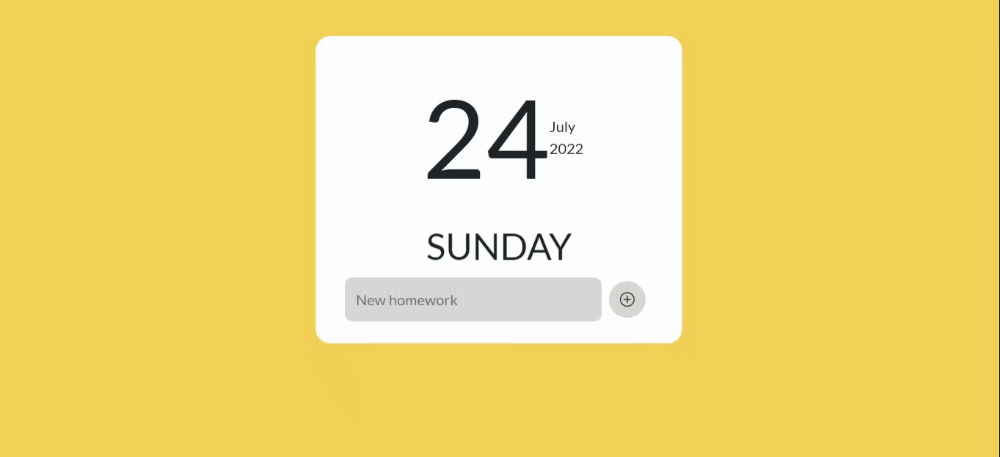

# Notes
This project was created with HTML, CSS and JavaScript. Sass was also incorporated for CSS support.
In this application you can create pending tasks to be carried out as well as cross off the tasks already carried out.

## Contents
This project has two branches:
"main" branch: where all its content is located.
"gh-pages" branch: where your "deploy" is located

## Demo
If you want to see the demo of this project deployed you can visit [Project demo](joseottonello.github.io/app-todolist//)

## How to clone
To clone this repository you need:
* Copy the repository link
* go to your code editor
* open terminal and type:
```bash
git clone + link
```

## Preview


### Notes
If you want to learn all about Sass I recommend you visit the site [Sass-long.com](https://sass-lang.com//)

If you want to learn everything about Markdown I recommend that you visit the site [markdown.es](https://markdown.es/sintaxis-markdown/)